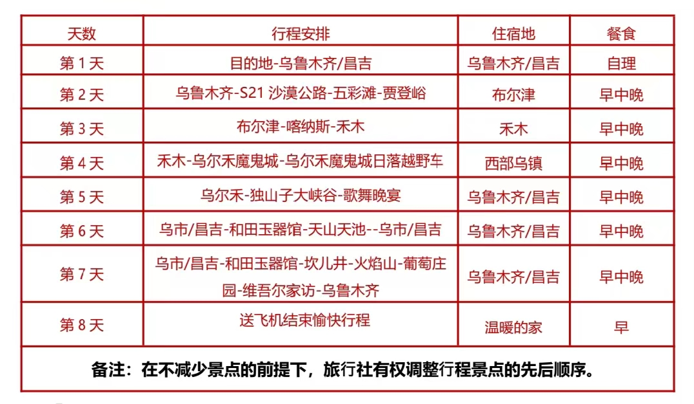

# “正经人谁写日记啊”

---
- **2025年07月02日**  今天练腿日，杠铃深蹲，(30,40,50,50,50,40)kg\*10，髋外展髋内收各3\*10。调整一下计划，练三大项之一，其他的减少点强度，感觉有点恢复不过来。每天应该精力充沛而不是看起来无精打采，否则与健身的初衷背道而驰。

  
- **2025年06月26日**  首次解锁杠铃深蹲。空杆，30kg，40kg，直到视频中的50kg。此前已解锁杠铃平板卧推，30kg做组。

<video width="420" height="420" controls>
<source src="/blogs/blog-20250626.mp4" type="video/mp4">
</video>

- **2025年06月09日**  如图所示。

- **2025年06月06日**  天雨虽大，不润无根之草。
  道法虽宽，只渡有缘之人。

- **2025年05月01日**  携媳妇走进健身房。

- **2025年03月08日**  出学院楼吃饭，楼里有门禁。有个小男孩跟保安说想上厕所，保安说去外面上。然后小男孩出去了，他妈问他怎么回事，小男孩乌拉乌拉说啥我也没听清。我说保安不让上，我带他进去吧。他妈妈跟他说快谢谢叔叔。等我带他出来的时候，他妈妈问他：跟哥哥说没说谢谢。

- **2024年12月5日**  获批国家自然科学基金理论物理专款博士后项目1项。

- **2024年12月1日**  人生需要Passion (Python)。

- **2024年11月10日**  在天、地、人等多方的见证下，于2024年11月10日（甲辰年十月初十）正式完婚。

- **2024年9月27日**  早上坐电梯，我是最后一个进的。这个时候过来一个60多岁的大爷在门口，他说：“哈喽，古德猫宁。外国人嘲笑我们是XX，我说我们中国人不是。你们先下去，我一会再下去”。然后我就把电梯门关上了。

- **2024年9月26日**  某人云：“言当以工作为主，勿作他念，更不可口造恶业，出语方人云云。”

- **2024年9月17日**  范大将军怒斥修改引力。作者：ChatGPT。
  “广义相对论蛮好的，你把它修改了干什么你告诉我。”
 

 
 

 

 
 

- **2024年8月29日**  从湖大到武大也就1个小时的车程，但我走了11年。

- **2024年8月28日**  上班第一天。

- **2024年8月19日**  出发前往武汉，准备报到，办理入站。

- **2024年8月9日—8月16日**  新疆8日游。跟团游，行程很紧凑。 [姜眠《我的歌声里》@QQ音乐](https://c6.y.qq.com/base/fcgi-bin/u?__=DA7z0kYI5441)。

- **2024年7月24日**  开始学习引力透镜。

- **2024年7月22日**  开始在武汉大学天文系从事博士后研究。合作导师：[廖恺教授](https://physics.whu.edu.cn/info/1272/6656.htm)。

- **2024年7月21日**  创建该个人主页。
